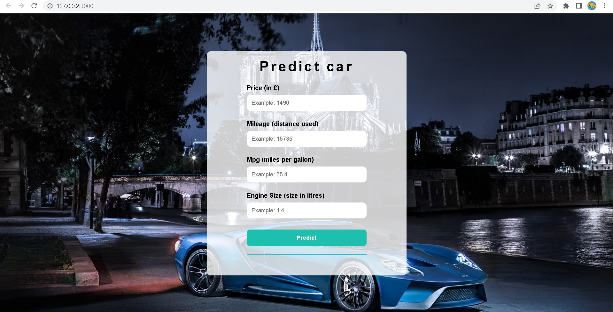
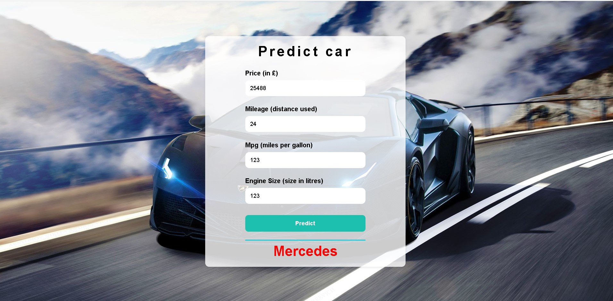

# Website-Predict-Car

## A website predict car based on features extracted from given data, using model RandomForestClassifier

## Image
 

## Tech
- Front-end: HTML,CSS, JAVASCIPT
- Back-end: Python

## Setup and run 
- Clone repo
 ```bash
      git clone 
 ```
 
 - Run in file app.py
 ```bash
      python app.py
 ```

